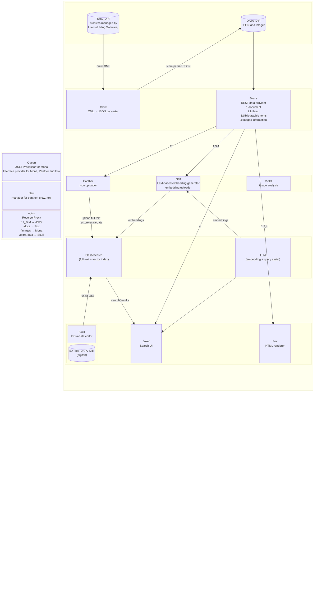

# Development notes
## Phantom system



joker
fe0000
c21819

mona
2b6bd7
566385

queen
898289
a2a0a5

skull
f9f242
ecd700


panther
de4283
c42a68

navi
5ea048
498a38

noir
a16cba
8c52a9

fox
05d2ff
1eabd9

crow
dedace
cbc6b0

violet
a743d9
9a36cc

### development
install dependencies
```bash
uv add ../queen
```
### building container
```bash
# build crow container in local
# build queen pkg at first 
cd queen
uv build -o ../crow/deps
cd ../crow
docker compose -f docker-compose.dev.yml build crow-dev

# or in github workflows
checkout
cd queen
uv build -o ../crow/deps
cd ../
docker build
```

