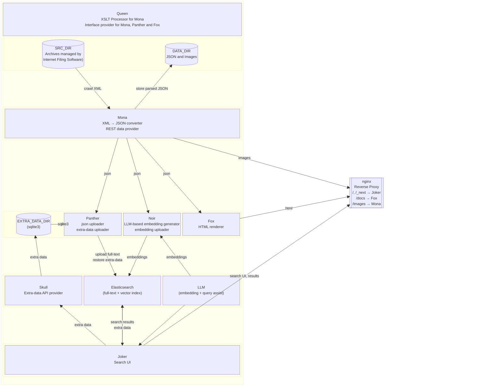

# Development notes
## Phantom system

```mermaid
block-beta
  block:all:1
    columns 1

    Queen["Queen\nXSLT Processor for Mona\nInterface provider for Mona, Panther and Fox"]:1

    %% -----------------------------
    %% Input / Storage Layer
    %% -----------------------------
    block:input_layer
      columns 2
      src_dir[("SRC_DIR\nArchives managed by\nInternet Filing Software)")]
      data_dir[("DATA_DIR\nJSON and Images")]
    end
    space

    %% -----------------------------
    %% Core Data Service (Mona)
    %% -----------------------------
    block:mona_layer
      columns 1
      Mona["Mona\nXML → JSON converter\nREST data provider"]
    end
    space
    space

    %% -----------------------------
    %% Processing Layer
    %% -----------------------------
    block:processing_layer
      columns 4
      extra_data_dir[("EXTRA_DATA_DIR\n(sqlite3)")]
      Panther["Panther\njson uploader\nextra-data uploader"]
      Noir["Noir\nLLM-based embedding generator\nembedding uploader"]
      Fox["Fox\nHTML renderer"]
    end
    space

    %% -----------------------------
    %% Search Engines / Models
    %% -----------------------------
    block:engine_layer
      columns 3
      Skull["Skull\nExtra-data API provider"]
      Elasticsearch["Elasticsearch\n(full-text + vector index)"]
      LLM["LLM\n(embedding + query assist)"]
    end
    space

    %% -----------------------------
    %% UI Layer
    %% -----------------------------
    block:ui_layer
      columns 1
      Joker["Joker\nSearch UI")]
    end
  end

  %% nginx is intentionally placed *outside* the main block
  nginx[["nginx\nReverse Proxy\n/, /_next → Joker\n/docs → Fox\n/images → Mona"]]


  %% -----------------------------
  %% Data Flows
  %% -----------------------------

  %% Mona
  src_dir -- "crawl XML" --> Mona
  Mona -- "store parsed JSON" --> data_dir
  Mona -- "json" --> Panther 
  Mona -- "json" --> Noir 
  Mona -- "json" --> Fox 
  Mona -- "images" --> nginx 

  %% Panther
  extra_data_dir -- "sqlite3" --> Panther
  Panther -- "upload full-text\nrestore extra-data" --> Elasticsearch

  %% Noir
  LLM -- "embeddings" --> Noir
  Noir -- "embeddings" --> Elasticsearch

  %% Fox
  Fox -- "html" --> nginx 

  %% Joker
  Joker -- "search UI, results" --> nginx
  Joker --> Elasticsearch
  Elasticsearch -- "search results\nextra data" --> Joker
  Joker -- "extra data" --> Skull

  %% Skull
  Skull -- "extra data" --> extra_data_dir

  %% Elasticsearch

  %% LLM
  LLM --> Joker 
```

joker アルセーヌ
mona ぞろ
panther カルメン
fox goemon
queen ヨハンナ
noir ミラディ
skull captain kid
violet cendrillon
navi ネクロノミコン
craw robinhood
